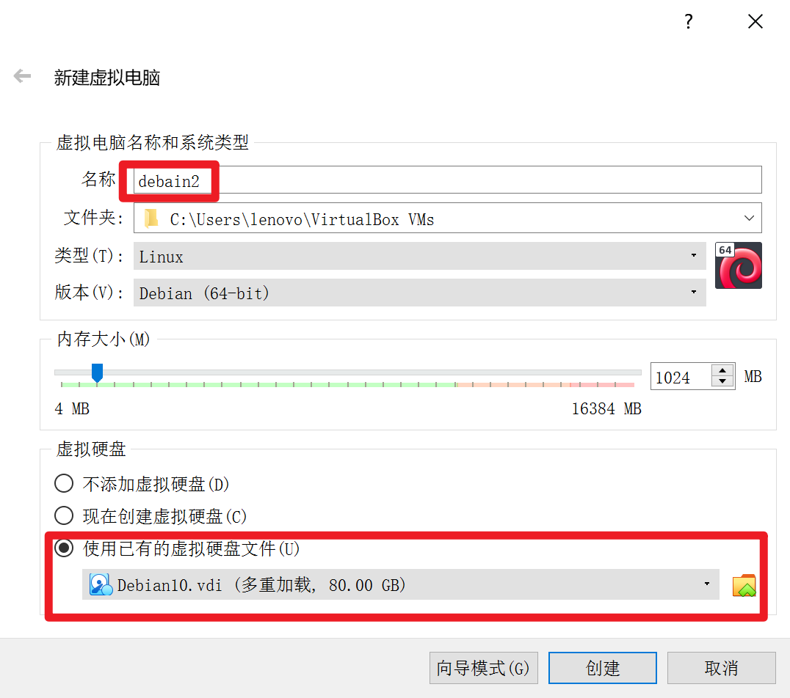
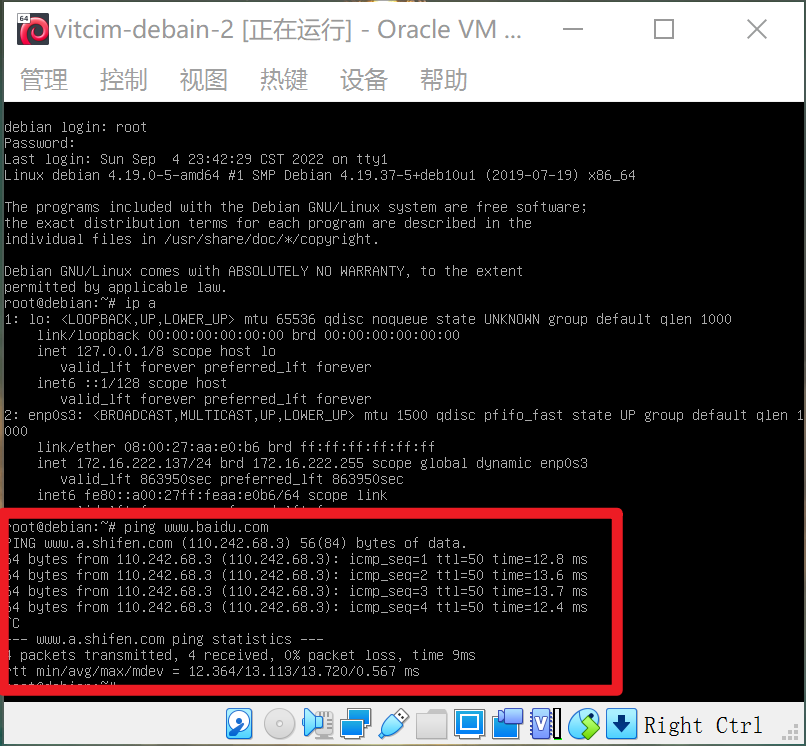

# Chap0x01
> author: oceanfish

## 实验环境
宿主机： Windows 10
virtualbox：
* Kali-linux-2022.3 （截至 2022.9.10 官网最新版）
* Debian 10 
* Windows XP sp3

---

## 实验要求

1. 虚拟硬盘配置成多重加载

2. 完成网络拓扑图的配置

3. 完成以下网络连通性测试:

* [ ] 靶机可以直接访问攻击者主机
* [ ] 攻击者主机无法直接访问靶机
* [ ] 网关可以直接访问攻击者主机和靶机
* [ ] 靶机的所有对外上下行流量必须经过网关
* [ ] 所有节点均可以访问互联网

---

## 实验步骤

### 1. 配置虚拟机多重加载

***---以下步骤以 Debian 为例，其他虚拟机同理---***

1. 进入 `virtualbox` 设置列表中的 `虚拟介质管理器`

选择 `释放` 将虚拟介质从已创建的虚拟机上解除，然后选择 `设置` 选项，选择类型 `多重加载` 然后应用

将其重新挂载回已创建的虚拟机中

创建第二台虚拟机，挂载已经设置为多重加载的盘片

全部配置完毕：

### 2. 配置网络拓扑环境

***---以 `Enterprise Networks-1` 为例---***

该网络包含一台 `xp` 和 一台 `kali`

>XP: victim-xp-1
>Kali: victim-kali

在 XP 上配置网卡1 `内部网络`，名称设为 `intnet1`

Kali 同理

在 Gateway-Debian 上配置网卡 1 为 `NAT`，配置网卡 2 为 `内部网络`， 名称为 `intnet1`

这样 XP，Kali 和 Gateway-Debian 连接在了内部网络1中
设置后 VirtualBox 会自动为其分配 IP 地址

*P.S. XP 系统需要关闭防火墙*

设置完毕后，XP 和 Kali 能够互相 ping 通，也能 ping 通 Gateway

在全局网络设定中设置 `NatNetwork` 添加新的网络设定

在 Gateway-Debian 和 Attack-Kali 网络设定中添加 `NAT网络`

###  网络连通性测试

#### 网络拓扑（Cisco Packet Tracer）

#### 测试

* [x] 靶机可以直接访问攻击者主机

* [x] 攻击者主机无法直接访问靶机

* [x] 网关可以直接访问攻击者主机和靶机

* [x] 靶机的所有对外上下行流量必须经过网关

> 抓包工具：tshark

Network1:

Network2:

* [x] 所有节点均可以访问互联网

victim-kali:

victim-xp-1:

victim-debian:

victim-xp-2:

attack-kali:

---

## 遇到的问题及解决
1. ping XP 系统时 ping 不通

解决：询问同学后得知需要将 XP 默认的防火墙关闭

2. 虚拟机挂载内部网络时没有效果

解决：Google 后得知需要将作为网关的虚拟机开启，才能进行 IP 地址分配

## 参考资料

[VirtualBox 多重加载配置](https://expoli.tech/articles/2021/06/07/1623066136894.html)

[VirtualBox 网络配置](https://www.nakivo.com/blog/virtualbox-network-setting-guide/)

[Linux tshark 抓包](https://blog.csdn.net/carefree2005/article/details/122131633)
