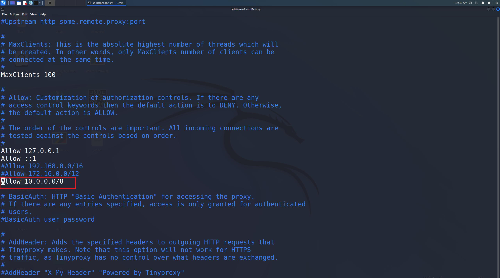
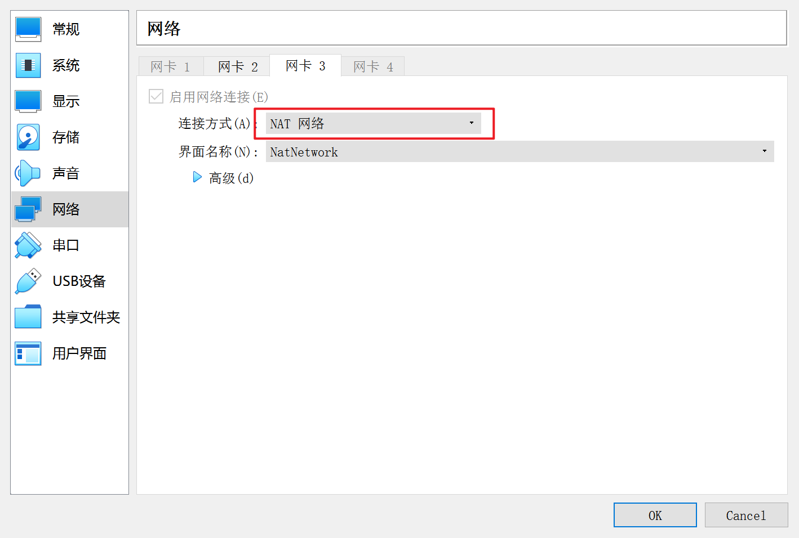
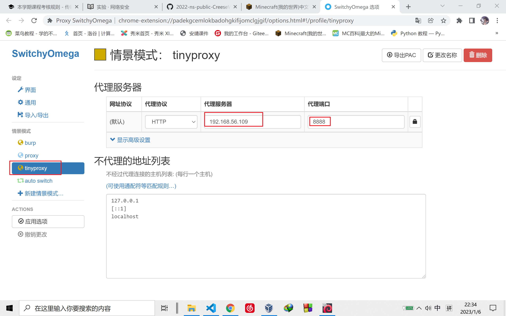
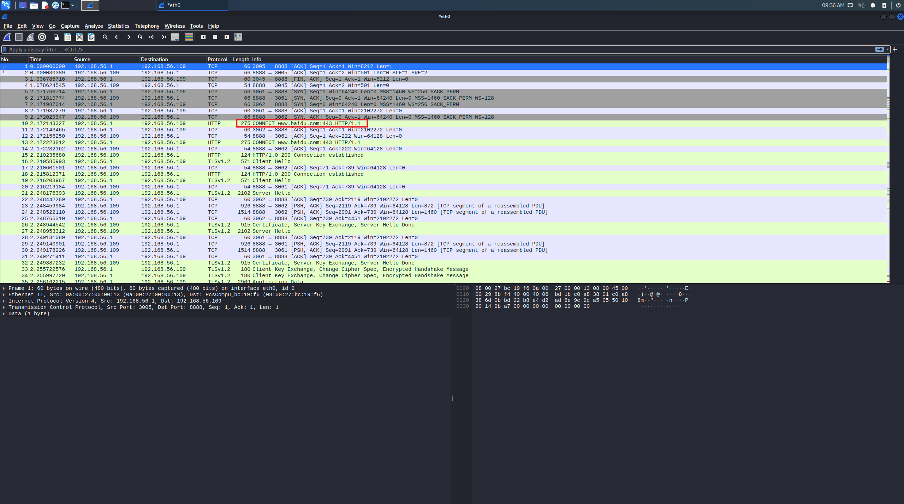
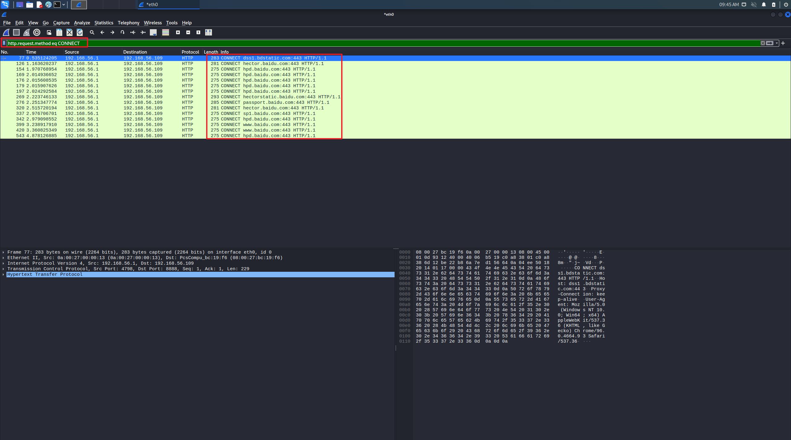

# Chap0x03

---

## 实验要求

* 安装 tinyproxy
* 编辑 tinyproxy 配置
* /etc/init.d/tinyproxy start
* 设置虚拟机联网方式为 NAT 和端口转发，默认 tinyproxy 监听 8888 端口
* 主机浏览器设置代理指向 tinyproxy 的服务地址
* 虚拟机里开启 wireshark 抓包
* 主机访问 https 站点
* 结束抓包，分析抓包结果

---

## 实验流程

安装 tinyproxy

```bash
sudo apt update
sudo apt install tinyproxy
```

配置 tinyproxy，取消 Allow 192.16.0.0/16 注释

```bash
sudo vi /etc/tinyproxy/tinyproxy.conf
```



配置虚拟机 hostonly 和 NAT 网络



配置宿主机浏览器代理设置（switchyomega）



在虚拟机中开启 wireshark 抓包，选择 hostonly 网卡
同时宿主机访问百度，可以在 wireshark 里面看到转发的流量包



通过 `http.request.method eq CONNECT` 可以查看 HTTPS 代理请求



而通过 `http.request.method eq GET` 可以查看 HTTP GET 代理请求


我们发现没有数据，说明在访问百度网址进行搜索的时候，所有的连接都是 https

---

## 遇到的问题与解决
* 虚拟机配置网络的时候代理无法访问

解决：
首先，虚拟机网络要设置为 `NAT` 而不是网络代理服务（NAT），然后要设置 hostonly 网卡，在 tinyproxy 的配置中取消 192.16 网段的注释，最后在浏览器的配置上输入 hostonly 网段的 ip 地址。

---

## 参考资料

[老师课件](https://c4pr1c3.github.io/cuc-ns/chap0x03/exp.html)